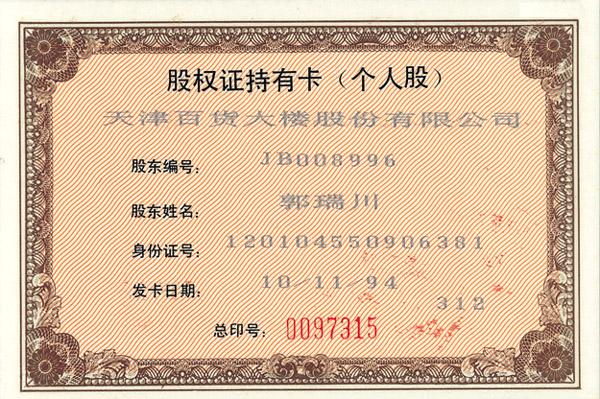

# Token(通证、代币)的应用场景

Token是一项很好的发明，但绝大部分Token用错了场合，被滥用作割韭菜的工具。

## 一、Token释义
Token，又翻译成通证，或代币。

Token是记录在区块链上的数字，本身没有任何成本。  
因为区块链不可逆可可篡改的特点，Token这种数字特别适合用来**代表**某种**权益**。

既然是**代表**，说明你本身已具有某种权益，Token只是用来做记录或代表。

比如股东的股权证；  
城市居民的房产证；  
农民的土地经营权证；

证书本身不值钱，或者只值一张印刷成本。  
值钱的是证书所**代表的权益**。

举例：一个股东有价值100万元的股份。他把股权证搞丢了，补办一张股权证只需花几十元，即证书工本费，而不是100万。

因为证书本身没有价值，只是所权益的一种直观代表。  
同理，Token本身没有价值，只是其技术特点适合作为某种权益的代表。

## 二、Token带来的便利 
### 2.1 以公司期权为例
很多创业公司给员工发期权，一般写在入职协议，或专门的期权协议里。  

思考如下场景：  
A员工只想在该公司工作，并不想要期权，公司并不能把期权折现给他。  
或者A员工想把期货转让给B员工，一般也不被允许。

如果引入Token，公司把给员工准备的期权写入智能合约，用Token代表期权，并写入公司章程。
  
那么A员工不必签订专门的期权协议，只需要接收期权Token。  
工作中，A员工不希望持有期货，而B员工看好公司前景，那么A可以把期权Token卖给B。

借助Token的便利，期权的灵活性就大多了。

### 2.2 以华为为例
2001年底，由于受到网络经济泡沫的影响，华为迎来发展历史上的第一个冬天，此时华为开始实行名为“虚拟受限股”的期权改革。

虚拟股票是指公司授予激励对象一种虚拟的股票，激励对象可以据此享受一定数量的分红权和股价升值权，但是没有所有权，没有表决权，且不方便转让。

如果借助Token加持，按预期融资额度发行Token（例HWT）。那么员工全于认购，便于转让。甚至可能有公司外部认可华为的资本收购HWT，则会极大激活资本的流动性。

## 三、再次反思 
你花钱买的Token，代表了什么权益?
+ 代表某公司的股份吗？
+ 代表某公司的期权吗？
+ 代表任何处房产吗？
+ 代表任何有形或无形资产吗？

都没有！ 背后没有相关权益的Token，是废纸一张，没有任何价值。   

## 四、初创公司，如何使用Token?
对于没有实际资产的公司，创业者希望通过Token来推进公司发展，通过Token激励员工奋斗。即－Token代表一种未来的希望，Token不应该收取任何费用。

在这方面，币乎（bihu.com）的key就是一种Token应用正确示范：
Key不要钱，用户登陆、回复、发贴、点赞等行为都会得到Key。  
假如bihu上市了，这些key就会具备实际的价值。  
创业者和用户不努力去发展，key则不能体现价值。

即：对未来美好的预期，用Token体现出来。  
创业者和用户，共同努力，为Token最终赋予价值。  

## 五、写在最后
也许有人说：你说的我都懂，我也知道Token没价值，但只是觉得明天能涨价。
“炒Token"也许赚，也许亏。

但是，无论赔赚，这是投机，风险很大。  
我们还是建议投资而非投机，老老实实投公链，长持2－3年，往往会有惊人的收获。

> 作者：燕十八  
> 微信： Yshiba  
> 日期： 2019/4/14 8:44:45  