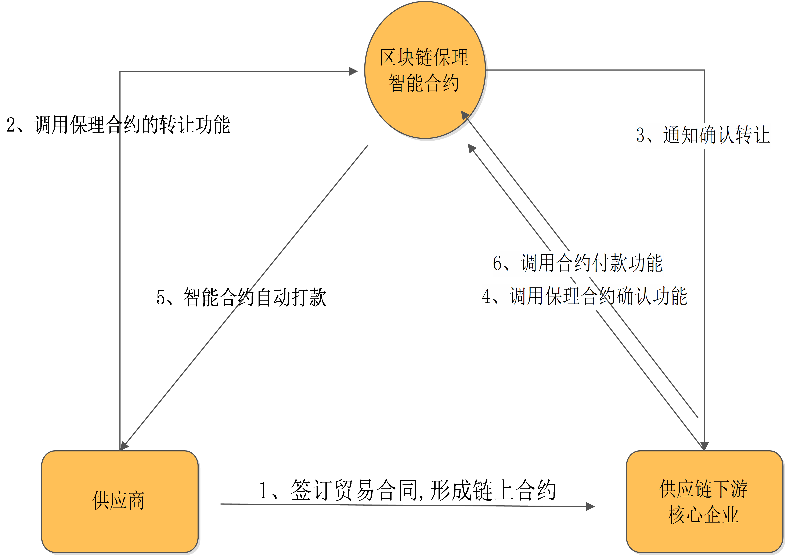
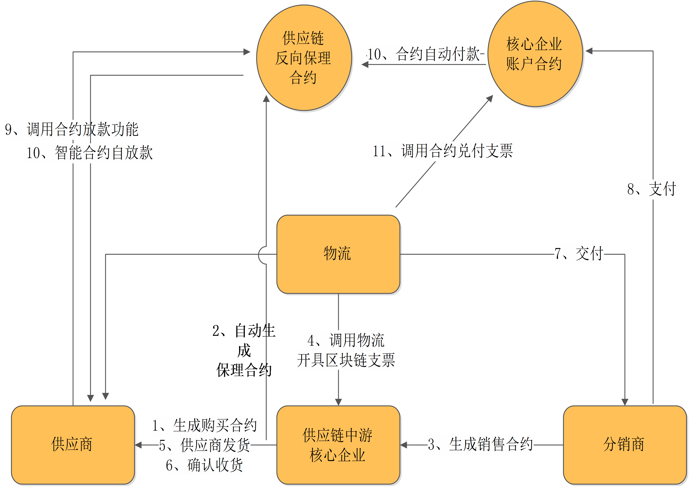
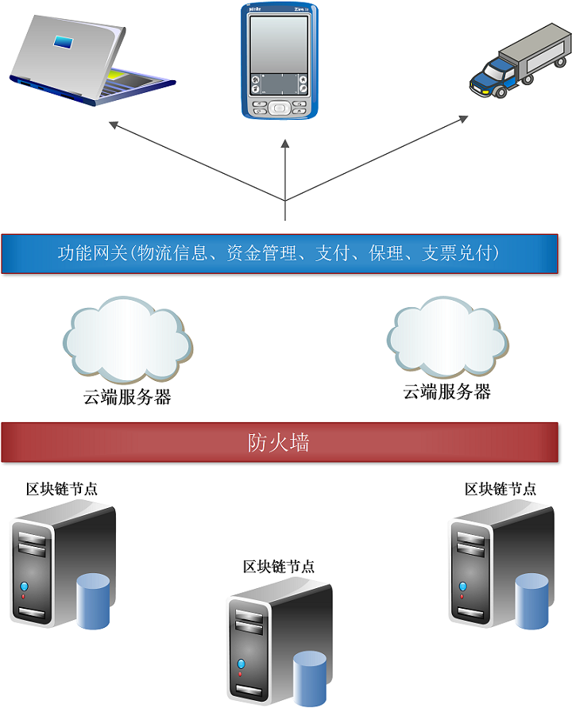

# 区块链与供应链融合瞻望
## 一、区块链思想清源

### 1.1 区块链是什么?
区块链是由加密学提供理论保障的分布式账本，从数学的角度保障数据的不可篡改，不可逆。
是人类历史上，首次通过数学提供去中心化信任保障。比起传统的信任保障（如银行、政府、商会、威权人物、强力部门），区块链成本极低且更为可靠。

### 1.2 不是什么?
区块链不是数据库，不是为业务提供“数据存储”。  
事实上，单纯的数据存储，传统数据库的效率是区块链的百倍以上。

区块链不是质检员，传统模式需要检验真伪的产品，无法由区块链完成。
如煤炭是否中间被调包，这样的需求区块链无法解决。

确切的说，区块是数据的保管员，而非检验员。

### 1.3 发展误区
当前一些区块链投资项目，存在“盲目上链”现象。单纯的把原本存在于数据库的数据，存放于区块链。
带来的负面有三：
1. 效率降低（见1.2）
2. 隐私暴露（区块链的数据具备公开性，和企业中的大部分数据保密需求不符合）
3. 只把数据搬个家，没有解决实际问题

因此，单纯的把数据搬上区块链既没有意义，又增加成本，降低效率。

### 1.4 能干什么
+ 数据保管－不可篡改
+ 数据溯源－不可逆
+ 数据执行－智能合约

以上3点具体实施在供应链行业，可满足资金托管、支付、分期、保理、融资、物流溯源等工作。

### 1.5 不能干什么?
+ 不宜存储隐私数据
+ 不宜存储高频数据
+ 不宜存储大块数据
+ 不能防止合同欺诈

## 二、智能合约
### 2.1 概念
智能合约是以区块链上以数据形式表达的业务逻辑，由于区块链上数据不可篡改，不可逆，从而约定的业务逻辑也不可取消，不能拒绝。

业务逻辑中可以对资产进行收取、管理、发送、预支等工作。

再根据具体业务，对智能合约进行编程，即可把商业流程托管在区块链。

### 2.2 作用
区块链管理数据内容，智能合约管理数据流动。
区块链是数据的保管员，智能合约是业务执行官。

以银行做比喻：
区块链管理账户数据  
智能合约管理业务流程

即：合同代码化；代码数据化。
数据上链确保合约不可逆的执行。

<!-- pagebreak -->

## 三、融合场景
### 3.1 保理业务
以区块链支持供应链金融的保理业务为例：
保理商只需考察供应链下游（核心企业）的信用情况和授予保理额度权限，其余工作均可由融资方（供应商），供应链下游（核心企业）自助完成，无需保理商人工介入。

保理业务的进行成本、执行成本都得到极大降低。

<!-- pagebreak -->

### 3.2 链内免支付业务
在供应链中，以核心企业的授信为基础，连接上下游企业。
通过智能合约自动完成保理融资、支票/商票兑付，自动向保理商付款等业务。
实现供应链内企业减少支付过程，提高支付效率。

<!-- pagebreak -->

### 3.3 系统架构
在区块链+供应链系统中，区块链起到底层生态的作用。稳定性、安全性和响应速度放在首位。

区块链服务器与云端服务器以防火墙隔离，仅以白名单形式连接。
云端服务器开启云盾，实现双重安全防护。

云端暴露功能网关，供PC端、H5端、APP、及车载设备通信调用。

<!-- pagebreak -->

## 四、政策面
目前，我国对供应链金融和保理都持鼓励和规范发展的态度，故供应链金融无论是从现在的发展态势还是未来的发展前景来看，都有较大的发展空间。部分摘录国务院、商务部、中国人民银行、银监会等部门文件：

|文件名称|文号|发文时间|
|--|--|--|
|国务院办公厅关于积极推进供应链创新与应用的指导意见|国办发〔2017〕84号|2017.10.05
|商务部办公厅 财政部办公厅关于开展供应链体系建设工作的通知|商办流通发【2017】337号|2017.08.11
|小微企业应收账款融资专项行动工作方案（2017-2019年）|银发〔2017〕104号|2017.04.25
|商业银行保理业务管理暂行办法|银监会令 2014年第5号|2014.04.03

区块链方面，国务院发布《“十三五”国家信息化规划》并提到“区块链技术作为战略性前沿技术”，各地政府态度非常务实，发展走在政策前面。案例如下：
2019.4.17，天津口岸上线区块链报关
2019.08.10，深圳推出区块链电子发票
2019.07.15，杭州推出基于区块链技术的公证服务

<!-- pagebreak -->

## 五、发展建议
### 5.1 优先建立底层生态
现阶段区块链发展类似2000年互联网发展阶段－概念已经普及，技术先进性已获得认可。

具体如何应用区块链于各行业商业模式中，投资者普通处于朦胧状态。

结合区块链的相关业务应用，也是探索成分居多。
如天津海关实施的区块链报关，深圳实施的区块链电子发票等。

此时更适宜以长远的目光，基于区块链技术搭建供应链行业的底层生态。

以核心企业为依托，引导上下游企业把业务托管在区块链，逐步完成资金托管、保理、融资等业务上链，进而为供应链行业提供底层生态。

### 5.2 优先抢占话语权 
目前政府和龙头企业虽然在具体业务上仍少有应用落地，但对于区块链技术的探讨很积极。

显然，面对区块链，各方不愿意错过这一波新技术红利。

因此，在行业内抢先布局区块链，形成“底层生态+技术标准+核心企业”的生态环境，以抢得行业生态的话语权。