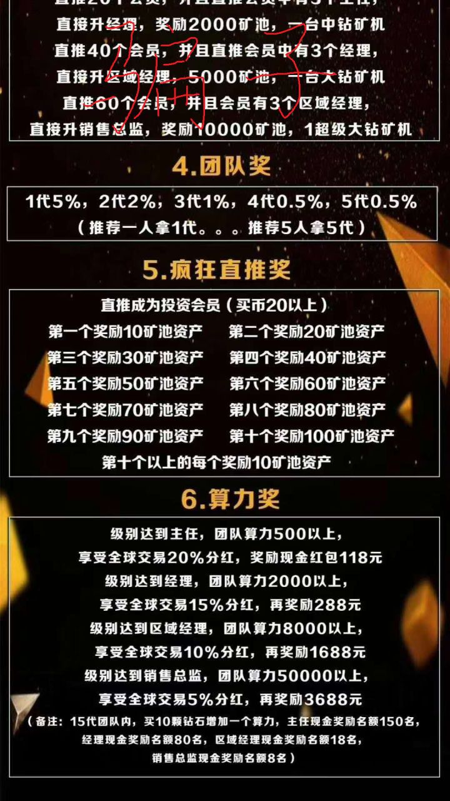

# 如何辨别空气币、传销币、资金盘

币圈一粒金千斤沙，如何淘去沙子，挑到真金，是个技术活。  
本文的目的，即是教给大家如何甄别空气币、传销币与资金盘。

## 一、数字货币的价值来源
在之前的文章中，已经揭露过绝大部分Token没有价值。

数字货币的价值来自来3个方面：
1. 锚定价值（例USDT，锚定美元资产）。
2. 对应权益（例HT、BNB能充当交易手续费）。
3. 有获得成本（如挖矿电费、矿机等）。

依据这3条原则，可以帮你过滤掉绝大部分空气币、传销币、资金盘。

## 二、空气币
”空气币“，就是只有名字和包装，无实际价值的币。

一般特点：
1、公司包装非常高大上，往往会借用很难追查的某国外公司站台，某机构、资本名义融资；
2、白皮书中大肆宣讲区块链技术，不讲自己，全是大道理；
3、宣传的公司地点不明，发起人包装的非常“厉害”，往往都是造假身份；

对于公链，获得时需要付出挖矿成本，有其成本价值（即使跌破成本价，也不会归零）。

Token（通证、代币）由于其技术特点，没有发布成本。
Token中的平台币（HT,OKB,BNB,QC等）可以在平台充当手续费，有对应权益。
还有像bihu的key，是用户创作的奖励，有版权权益。  
Token中另一些，如USDT，背后有锚定的等值资产，也有其价值。

除此之外， 绝大部分的Token（通证、代币）都是空气币。

2018年末，各交易平台下架了至少1/4的币（俗称归零币），这些下架的币全是Token（通证、代币）。

碰到Token，只需要按上述原则提问3个问题，即可识破：
+ 币是用耗电的矿机挖的吗？
+ 币能体现权益吗？（如充当平台手续费）
+ 币有对应的等值美元吗？

## 三、传销币
传销币则是借助数字货币的热度，做传销的事实。
传销币的运行，和区块链完全无关，往往只有一个供会员下载的APP或网站。

传销币的特点：
1、发展下线，拉人头
2、许诺稳赚不赔
3、通过网站、APP或线下交易
4、一般从身边人先手
5、中心化不开源，毫无价值

例如以下币：
如火爆一时的五行币、维卡币、Vpay币
暗黑币、MBI-易物币、AC亚洲币、山寨版“恒星币”、分红点币、长江国际虚拟币
、克拉币、雷达币。

## 四、资金盘
资金盘则是手快打手慢的入金－出金游戏，一般是包装成xxToken来运行。

典型特点：
+ 日收益1%甚至更高
+ 下级入金有提成，一般提3－5级。
+ 出入金有周期限制，大多7－15天一轮
 
常见套路：
+ 高频套利（宣称拿币在各交易所赚价差，但实际上根本没有做交易，且交易所价差根本支撑不了日息）。
+ 智能钱包（号称币存入其钱包，会自动在交易所套差价）
+ 智能搬砖（同上）
+ 购物返利（100元购物，7天后110元回收）
+ 新零售（同上）

## 五、防骗关键词
如果你不懂技术，我教你几个最简单的识破骗局的办法：
碰到以下关键词，立即走，打车走！

+ 高频套利
+ 智能搬砖
+ 智能钱包
+ 节点、共振
+ 静态收益
+ 动太收益
+ 烧伤机制
+ 管理奖、直推奖、团队奖
+ 发放首码
+ 一代、二代、三代

资金盘典型方案：
