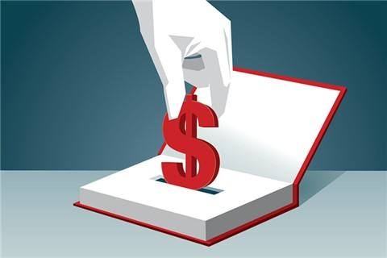

# 学习还能赚钱，区块链或改变教育行业

付费学习，很多人都已习以为常。借助区块链赋能，反转学习模式，则学习还可以赚钱。

## 一、学习是增值的过程，应当获得收益
人类因学习而不断进步，从来没见过哪个国家、民族越学习越后退的现象。

这是因为，学习对于人类是一个增值的过程。知识增长，技术变强，效率变高，继而提高生产，实现增值。

以老师的角度考虑，教学要付出很多心血，收费无可非议。

另一个角度，老师的付出+学员的进步，对于社会整体却增值的过程。所以，学习不仅可以免费，还可以赚钱。

## 二、学习是一个创造的过程，创造出有价值的东西
学员在学习过程中，会总结出很多有价值的东西。  
如数学笔记、英语美文、记忆技巧、短视频等。

例：
+ [国外学霸1700页数学笔记](https://castel.dev/post/lecture-notes-1/)，其精美可以达到出版程度。
+ [清华学霸笔记](http://dy.163.com/v2/article/detail/D3S0VFUM0516IEB2.html)，已有出版商邀请出版。

同时，在学习过程中会有一些价值体现的过程。  
例如：编程学习中，为同学配置环境、答疑、调试Bug等过程。

这些有价值的东西很多，如笔记、资料等，大部分随着毕业就扔掉了。  
在学习过程的互助，如答疑、调试Bug等，也没谁好意思为对方要10元钱做报酬。

## 三、一些学习论坛做出的尝试
很多学习论坛，如编程类论坛、数学论坛、百度知道等，一般会给优质资料上传者以金币，或者给答疑者金币。

这些论坛都是相互孤立，A论坛的金币不能拿到B论坛去用；  
金币也不能变现，只能坛内消费；  
论坛哪天不运营了，金币全作废。  
综上，对学习者的激励不大。

如何能让学员的优质知识长久保存，并在分享中体现价值？  
区块链，或许为我们找到答案。

## 四、区块链如何赋能教育？
在区块链上，学员学习过程的价值体现为Token。

学员学习过程中，优秀的作品、作业、笔记、答案、思路等发布到区块链，利用区块链不可逆的特点使其长久保存，并得到Token奖励。

学员在互助学习，如答疑、调试过程中，可以发布Token悬赏或直接转给对方Token,避免了直接付现金的尴尬。

利用区块链全球流通的特点，使得有知识兑价的Token，可以在各行业、各地区的学习过程中发挥价值。

这样，学员的学习过程产生的价值得到体现，优秀内容得以保存，互助过程也促进了Token的流通。

## 五、说明
由于儿童的心理和学习方式与成年人相差巨大，以上讨论不适合儿童教育，仅指针对成人的知识性学习或技术能培训。

> 作者：燕十八  
> 微信：Yshiba   
> 时间：2019年4月18日  