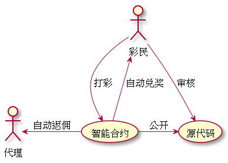

# 杜绝黑幕，区块链对博彩业的冲击
  
人类堵博的历史非常悠久，公元前3000年就出现了掷骰子游戏；可以肯定的是，堵博仍会伴随着人类继续前行。
  
堵博的危害更多的来自于巨大利益伴随的暴力、骗局、黑幕等。
  
在人类无法杜绝堵博行为前，创造一种公平、透明、没有后台操纵的公平菠菜，也是当前的一种次优解。
  
## 一、东南亚“杀猪盘”
  
所谓杀猪盘，就是键盘手先和猪建立以谈感情为由，建立起较为融洽的关系，并引诱猪玩菠菜。
他们把那些感情寂寞的人叫做猪，把建立恋爱关系叫做养猪，把最后的诈骗叫做杀猪。
  
这些“杀猪盘”许多都开设在东南亚地区，最严重的四个地方为菲律宾马尼拉地区、柬埔寨西哈努克港市、老挝金木棉特区、中缅边境地区。
  
这些盘，下注者根本无法提现，纯粹的骗局，请读者不要有任何侥幸心理去尝试。
  
## 二、福彩迷雾
  
2017年以来，继陈传书、鲍学全之后，王素英是第三位落马的福彩中心主任。  
且在她之前，福彩中心一位原副主任王云戈，2016年也因涉嫌严重违纪落马。
  
福利彩票自1987年开始发行，累计销售近1.8万亿元。彩票销售额逐年攀升，但彩票造假、暗箱操作、彩票机构违规违法、工作人员涉及贪腐时有发生，彩票在销售、开奖、资金监管、公益金去向等环节屡屡遭受质疑，先来看几个案例：
  
### 2004 开奖视频疑似露马脚
  
2004年，“双色球”第2004009期开奖直播时，左下角摇奖机特写镜头与大的画面不同步。在视频广泛传播后，福彩中心解释称，开奖当时拍摄小画面的机器出了问题，于是进行了事后补拍。彩民原本就对开奖结果是否存在“猫腻” 有怀疑，此事一出更是引起轩然大波。
  
### 2009年 程序员操控中奖结果
  
2009年6月9日，福彩2009066期开出九注头奖，每注奖金661万，然而深圳3305万的五注头奖却一直无人认领。随后，深圳警方宣布深圳中奖系黑客舞弊所为。
有彩民认为，福彩中心不敢透露黑客的作弊手法，是为了掩盖摇奖结果被操控的事实。
  
## 三、人性的无力
  
>有50%的利润，资本就会铤而走险；为了100%的利润，资本就敢践踏一切人间法律；有300%以上的利润，资本就敢犯任何罪行，甚至去冒绞首的危险。－马克思
  
人性在利益面前，毫无抵抗力，甚至不惜冒着坐牢的风险。
  
人性禁不起考验，监管又不够透明。福彩屡暴丑闻也就不足为奇了。
  
## 四、区块链技术杜绝黑幕
  
利用区块链的公开、透明、不可逆、可溯源的特点，让菠菜运行在阳光下。
  
具体实施如下：
1. 打彩到智能合约，数据上链。
2. 智能合约自动开奖，数据上链。
3. 智能合约自动兑奖到账户。
4. 智能合约自动反佣到代理账户。
5. 代码开源，供用户审核。
  
下注、开奖、兑奖、返佣，整个过程都体现为区块上的每一笔交易，可以在区块浏览器上看到。
  
由于智能合约，“代码即法律”的特点，整体过程不可能被任何人操控。所有人都在代码的规则下公平游戏。
  

  
  
## 五、代码开源
  
代码开源很重要，由于智能合约的菠菜无法造假，也无法操控，因此代码没有保密的理由。
  
所以正常的区块链菠菜应用，一定是敢把代码公开的。
  
否则，我们也有理由怀疑其中有猫腻。
  
## 六、踏着七彩祥云的英雄
  
现在币圈有一个共识－－当前的区块链，缺乏爆款应用。
  
我在文章“区块链，下一个十年的风口”中也提到过，区块链下一个十年的重心必将由概念转向落地应用，且必须能对某行业产生降维式打击的应用。
  
币圈都在期待，一个爆款应用的诞生，就像紫
而菠菜行业，最有可能率先诞生独角兽。
原因有二：
1. 体量巨大，全球4000亿美元/年。
2. 黑幕太多，区块链恰好解决痛点。
  
哈迪斯链也许就是币圈苦苦寻找的踏着七彩祥云的英雄！
  
## 七、哈迪斯链介绍
  
哈迪斯链 -- HadesChain (HDC) 专注菠菜业的底层公链。
  
项目优势：
  
### ✔ 独特的网桥技术
  
打通ETH和HDC，使用户可以用哈迪斯币(HDC)与以太坊(ETH)实现跨链互转。
  
### ✔ 生态健全
  
目前已有生态：公链、区块浏览器、网桥、钱包、应用。
  
官网主页：https://www.hadeschain.org
可查看以上生态。
  
### ✔ 产品落地
  
丰富的菠菜应用，如快三、3D、幸运28。  
后期将逐步上线足球、篮球竞彩等大众娱乐项目。  
目前已开奖数千期，做到了公正、公开、透明。
  
### ✔ 源码公开
  
源码：https://github.com/hadescoin/hadescoin.github.io
  
同时哈迪斯悬赏100万，寻找项目中的开奖黑幕！
  