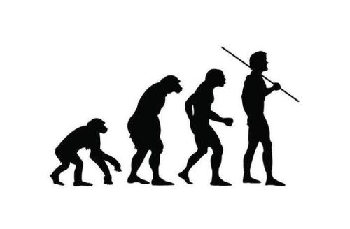

# 枪炮VS数学 区块链的伟大革命

## 前言
人往往意识不到当前的时代，当这个时代结束回顾时，才发现这这个时代的伟大。

瓦特改进蒸汽机后，当时的人并没有意识到，人类已经步入第一次工业革命；  
1866年，西门子制成发电机，当时的人也没有意识到，电气化时代已经来临并将影响世界格局；  
2009年，比特币创世区块诞生，我们也很难意识到，一个数学对抗权力的去中心化时代已经开启。

也许要等到若干年后回望时，人们才知道区块链给社会带来的伟大变革！

## 去中心化简史
在有记载的5560年的人类历史上，共发生过大小战争14 531次，只有329年是和平的。  
这些**战争的进程**，也是人类社会**中心化的进程**。

公元前221年，秦统一六国，率先在东亚地区建立了一个高度中心化的帝国。  
仅14年后，秦朝覆灭。其后西汉大封诸侯，中心化程度降低。  
汉景帝的削藩令，意图加强中央集权，提高中心化程度，引发七国这乱。  
直到汉武帝发布“推恩令”，缓缓削弱诸侯，再次高度中心化。  

由于古代生产力、交通方式、通讯方式的限制，中心化程度有其上限。在古代诸侯国中间，往往存在着王权管不到的“隙地”，类似于桃花源的存在。

近现代以来，随着火车、汽车、电报、电话、互联网等发明，人类社会变得扁平化，交流方式瞬时化。同时，科学的进步，可以使用指纹、DNA精准的辨识每一个人。  
这种条件下，使得政府的权力触角可以直到每一位个体公民。

社会的中心化达到巅峰！

## 铸币权

拥有铸币权，就拥有收割权，这是涉及到国计民生和国家经济的稳定核心权力，所以世界各国一般都会绝对垄断铸币权。

国民党后期通过金圆劵疯狂搜刮民众财富，比如著名京剧演员梅兰芳先生，将200两足赤黄金存入银行，兑换金圆劵。仅仅40天后，一筐金圆劵还换不回一筐白财。梅兰芳毕生血汗被收割一空。

失去铸币权则无法有效管理财政。

明朝时，白银成为事实货币，明廷失去铸币权。到明朝后期，白银通缩，崇祯连军饷都凑不够，眼看着明朝灭亡。

美国凭借强大的军力，拥有世界币－美元的铸币权，因而能够通过美元收割全世界。

妄图挑战美元霸权的人也付出了相应的代价，比如卡扎菲。

可见，铸币权可是要靠血与火，枪与炮才能得到的东西。  
在一个稳定强大的国家，没有哪个人或公司会妄想用暴力夺取铸币权。

然而，中本聪一项天才的发明，为民众取得部分铸币权！

## 公平的数学

有句话说，这世界上只有死亡是公平的。我要补充一句，“数学比死亡还公平”。

枪炮可以征服国家，但无法改变数学。  
即使美帝的航母，也无法改变质数的性质和π的值。  
也无法通过Bitcoin的地址逆算出私钥。  
即使美国政府，也不能通过行政命令变出2200万比特币。

所有人、公司、国家，面对区块链，都在数学面前，保持平等。

回顾前言：`人往往意识不到当前的时代`。在已经高度集权中心化的社会，中本聪通过数学，非暴力的形式为民众夺得部分铸币权，这是天才的发明，革命性的发明。

这是货币史上重要的里程碑，也是社会发展史的重要里程碑。  
不要等到这个时代过去，才意识到这个时代的伟大！

> 作者：燕十八  
> 微信： Yshiba  