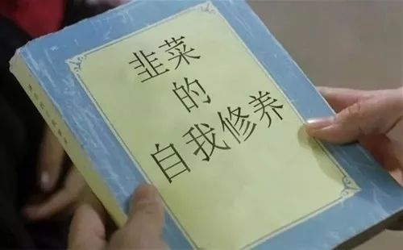

# 为什么这个韭菜总被割？

总是这棵倒霉的韭菜：买空气币，加付费群，熬夜抢IEO被耍猴。  
为什么这个韭菜总被割？

## 一、贱急懒蠢坏，被割不奇怪
**贱：** 只愿意听对自己有利的消息。
  
比如买XxToken，Yx传销币被套，内心痛苦异常。  
你告诉对方：“这是传销币，没有价值”，对方大概率反唇相讥，甚至恶语相向。
托儿高声喊：“Xx币只是在洗盘，洗完要猛拉”。对方则欣然接受，继续幻想。  

对于投资者，眼里应只有客观消息，不应区分好消息和坏消息。

**急：** 恨不得今天投资，明天就财务自由。  
你对一个投资者说：“投5万主流币，3年后大概率能翻倍甚至3－5倍”，投资者往往嫌慢。转身就跑到网吧，包一排机器去抢某个IEO币，盘算着一晚上涨10倍。  
结果：币没抢到，平台币锁仓爆跌。（4月10号OK平台抢积木去，被套的可大把大把哟）

**懒：**  不愿意学习，总想直接要答案。例－分析师写了一篇文章，部分投资者直接回复：“老大，多还是空？”。  
永远只要一句话：“多还是空”，这种行为和赌博押大押小没有区别，还不如去赌博。  
不学习就在币圈行走，不异于送人头。

**蠢：** 生活中有些人生病不爱去医院，专信各种“偏方”。币圈有些投资者，不看行情基本面，专喜欢听小道消息。什么XX币要拉盘，什么XX大佬已梭多。要知道，这些小道消息放出来，必须有其目的，不可轻信。

即使消息是真的，传到终端用户耳朵里时，也已经过了几手，时效性已经打折扣。

**坏：** 明知某个币是传销币（现在传销币改名叫“模式币”），还拼命宣传拉人，腹黑的想法是后来者给他填坑。对不起，操盘手在你上面看的一清二楚，你再拼命也是替操盘手卖命。

## 二、防割严肃建议：
币圈可比股市凶险多了，1个好项目，999个陷阱项目。我不能帮你直接挑出金子，但可以教你识别沙子。

+ 学习、学习、学习
+ 不要加太多群
+ 不要盲从大V
+ 炒公链，别碰Token

**学习：** 想投资区块链，至少要掌握这几个入门知识－查询区块浏览器、区分Coin与Token、使用本地钱包、会导出/导入钱包、区分传销币。

**不要加太多群：** 加的群越多，听到的各种消息越多，噪音越大。只会干扰自己的判断。

**不要盲从大V：** 有某大V次次期货都做吃10%以上的波段。按照他的胜率计算，资产都该10亿了，还需要搞小密圈、收费群苦逼的赚点会员费？ 你以为大V是搞期货的，其实人家是收会费的。还有著名某狂，和垃圾项目方配合割过几次韭菜了。

**投公链，别碰Token：** Token纯粹是空气，没有任何价值。（话说的有点重，某些场合Token也有应用价值。但当前市场的99.9%的Token都是空气币。）

最后：为了让读者认识到Token是空气，下期文章搞个送1个亿Token的活动。
加本人微信, 下期文章每人送1个亿 airt (AirToken)。

> 作者：燕十八  
> 微信： Yshiba  
> 日期： 2019/4/11 9:12:36 
