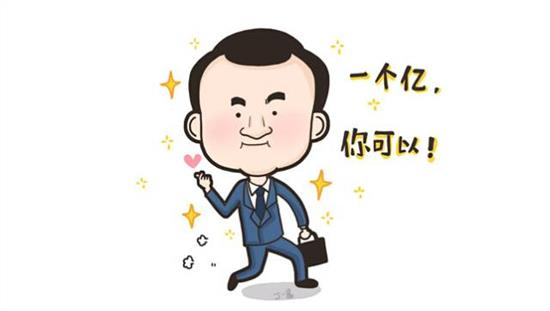

# 送你一个亿
没和你开玩笑，我要送1个亿，让你知道Token的本质与价值。

## 一、Token没有任何价值
### 1.1 快速理解区块链
用一个通俗的比喻来说：
以太坊是一家高档白纸厂，生产的白纸（区块）一张连着一张（链）。

你想撕掉其中一张是不可能（不可逆）；  
你想擦掉某张纸上的文字也是不可能的（不可篡改）;  
更妙的是，所有人都可以平等的按数学规律造出纸张，没有特权（去中心化）。

这样的高档白纸用来写合同、立字据、发期权简直太合适了。
你说这种高档白纸得多少钱一张？ 怎么着写得1000多块钱一张吧。

没错，现在以太坊的价格约是1200元。

### 1.2 Token是什么？
我们在以太坊的白纸上，写一个字据：

```
兹有空气币(AirToken) 100亿枚。
允许自由转让。
```

接下来，我再在白纸上写一个字据：
```
我声明：
这100亿个Token，转给小韭菜1亿枚。
```

好了，给你的1亿就是Token。

### 1.3 Token的价值
问：这个字据谁都可以立吗？  
答：是的。  
问：谁能可以还有什么价值？老子还宣称自己有1000000亿呢！    
答：是的，Token没有任何价值。  
问：没价值又怎么样？我买的Token赚钱了。  
答：你赚钱说明有人接盘，和其价值无关。传销也能赚钱，并不意味有价值。  
问：Token一点意义都没有？  
答：Token有其应用场景，下期文章专门讲Token的应用场景。但当前，Token被滥用成空气币和传销工具。

## 二、送你1个亿
上一篇文章提到，要送给每一位读者1个亿，现在兑现承诺。

用imToken钱包、Trust钱包，或任意Ethereum钱包，往空气币airt的合约地址0xa6208a0e09ca0122e7736fc84750cee329783b04`转0个ETH，即可得到1亿枚airt。

imToken和Trust都支持Token自动显示，如果没显示出来，可手动添加Token的合约地址`0xa6208a0e09ca0122e7736fc84750cee329783b04`。

## 三、Token(空气币)的原理解析
其实代码很简单，只有下面33行，多一行都不用，就能打造一个空气币arit(AirToken)。

1. 安装chrome浏览器+MetaMask扩展。（不会请看[教程](https://blog.csdn.net/niumenglong1/article/details/80795796)）
2. 打开 https://remix.ethereum.org  复制下方代码,编译执行即可。  
3. 执行完毕后会生成合约地址。
4. 接下来，做一个高大上的新闻发布会，推销你的Token（空气）吧！

```
pragma solidity ^0.5.2;

contract AirToken {

    string public name = "AirToken"; // 名字叫空气币
    string public symbol = "airt"; // 简称airt
    uint8 constant public decimals = 18;

    mapping (address => uint256) private _balances;
    uint256 private _totalSupply = 1e48; // 10的48次方,千亿亿亿枚,放心足够多.

    event Transfer(address indexed from, address indexed to, uint256 value);

    function() payable external
    {
        _balances[msg.sender] += 1e26; // 送1亿枚
    }

    function totalSupply() public view returns (uint256) {
        return _totalSupply;
    }

    function balanceOf(address owner) public view returns (uint256) {
        return _balances[owner];
    }

    function transfer(address to, uint256 value) public returns (bool) {
        _balances[msg.sender] -= value; // 此处有漏洞，故意留的
        _balances[msg.sender] += value;
        emit Transfer(msg.sender, to, value);
        return true;
    }
}
```

## 四、写在最后  
通证（Token）的获取只需要33行代码，没有任何代价，自然也没有任何价值。
现在明白了吧，碰到Token、通证这些样的，最好赶紧走开，打车走，坐高铁走。  
要投就投公链。

如果之前你买Token亏损了，怪自己知识储备不够。
看了这篇文章之后还投资Token，亏损只能怪自己贪了。

## 五、附录[视频教程] 5分钟开发AirToken
 [](http://www.youtube.com/watch?v=Wjhs7FnWFkM "")